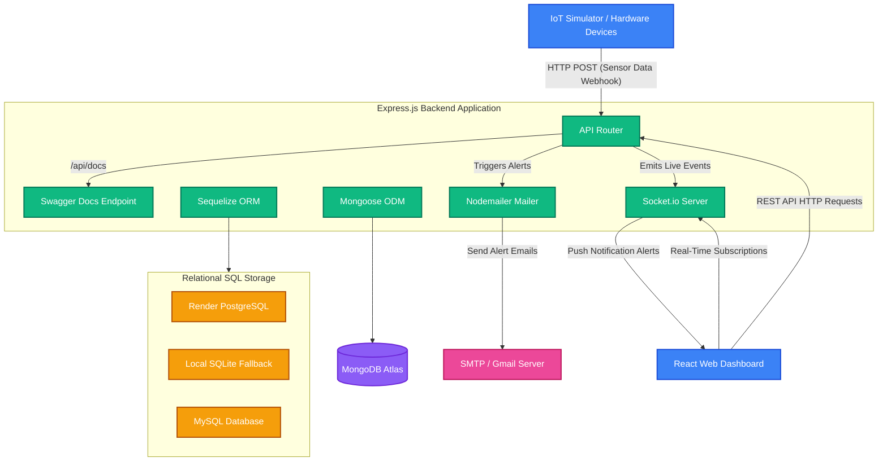

# System Architecture
## Smart Energy & Security Monitoring System

---

## Overview
A full-stack hybrid IoT system designed to monitor energy consumption, device health, and security across a hostel or campus in real time. It uses a hybrid database design combining SQL and NoSQL to balance relational metadata integrity and high-write throughput.

---

## System Architecture Diagram

---

## Hybrid Database Architecture

The system uses a **Hybrid Database Strategy** to maximize performance, cost-efficiency, and flexibility:

### 1. Relational Database Layer (SQL via Sequelize)
Stores static and relational configuration metadata.
* **Dialect Adaptability:** Programmed with dynamic database selection:
  * **PostgreSQL:** Primary production database for Render deployments.
  * **SQLite:** Automatic, zero-configuration local fallback for development, sandbox environments, and ephemeral testing.
  * **MySQL:** Supported where a MySQL server host is configured.
* **Entities:**
  * **Users:** Credentials, contact details, and role-based permissions (Admin, Warden, Viewer).
  * **Rooms:** Floor numbers, building info, occupancy status, and maintenance history.
  * **Devices:** IoT device attributes (MAC/Device ID, type, room assignment, status).

### 2. Time-Series & Event Layer (NoSQL via Mongoose)
Handles high-frequency, write-intensive sensor data and notifications.
* **Database:** **MongoDB Atlas**
* **Entities:**
  * **SensorData:** Real-time stream of power usage (kWh), door status (open/closed), motion, and room temperature.
  * **SecurityEvents:** Logged security incidents (unauthorized entry, night motion, door forced).
  * **Notifications:** User notifications with read/unread statuses.

---

## Tech Stack

| Layer | Technology | Purpose |
|---|---|---|
| **Frontend** | React (Vite) + Tailwind CSS | Interactive, real-time tracking interface |
| **Backend Runtime** | Node.js v18+ | Fast, asynchronous event-driven backend execution |
| **Framework** | Express.js | RESTful routing and middleware integration |
| **Real-time** | Socket.io | Bi-directional, real-time alert/event streaming |
| **Database ORM (SQL)** | Sequelize | Object-Relational mapping with PostgreSQL, SQLite, and MySQL support |
| **Database ODM (NoSQL)** | Mongoose | Document modeling for MongoDB Atlas time-series streams |
| **Notification Engine** | Nodemailer | Email warning system for critical events |
| **API Documentation** | Swagger UI + OpenAPI 3.0 | Live developer documentation and sandbox at `/api/docs` |

---

## Key Data Flows

### 1. Inbound Sensor Webhook
1. **IoT Device / Simulator** posts JSON data to `/api/sensors/data`.
2. **Server** validates the device and room exist in the Relational Database (SQL).
3. If valid, the reading is logged to **MongoDB**.
4. If a critical threshold is breached (e.g. motion at night, door left open):
   * A **SecurityEvent** is registered.
   * **Nodemailer** dispatches warning emails to the administrator and warden.
   * A **Notification** document is saved to MongoDB.
5. The reading is immediately pushed via **Socket.io** to all connected client rooms.

### 2. Real-Time Dashboard Updates
1. Dashboard client logs in using **JWT Auth** and establishes a secure socket connection.
2. Client joins a specific room channel using `join-room` event.
3. Server streams live updates (`sensor-data`, `room-data`) directly to the clients, updating visual components in real time.

---

## Security Framework
* **Access Control:** Role-Based Access Control (RBAC) enforces `Admin > Warden > Viewer` logic across all REST API controllers.
* **Authentication:** Stateless token-based auth using **JSON Web Tokens (JWT)**.
* **Cryptography:** User passwords hashed using **bcrypt** (salt rounds: 10).
* **Environment Security:** Secure `.env` architecture holding Mongo URI, JWT secret, database credentials, and SMTP mailer secrets.